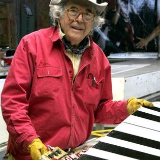

# Walking piano (BigPiano)

## À propos de BigPiano
Sans doute le piano le plus célèbre en raison de sa scène mémorable dans le film de Tom Hanks "BIG" (1988).

"The Walking Piano" ou "Big Piano" a été créé par Remo Saraceni et installé pour la première fois dans le magasin de jouets FAO Schwarz à New York, en 1982.

Saraceni concidérait ce projet comme une fusion de danse, musique, lumière et de jeu en utilisant les pieds pour créer une mélodie.

Des versions du piano ont été installées dans des musées, des hôpitaux pour enfants et d'autres espaces publics du monde entier.

## Son histoire
Ayant une valeur de 300 000$,le BigPiano à été dévoilé en 1982, dans le studio interactif imaginatif de Saraceni, où la technologie de pointe a alimenté une créativité artistique illimitée et une science imaginative.

En 1983, le Big Piano a reçu une reconnaissance nationale lorsqu'il a été présenté avec son inventeur dans les principaux journaux, magazines , radio et télévision.

Remo Saraceni et sa philosophie de l'interaction humaine avec la technologie sont devenus de plus en plus intéressants pour le public et le Big Piano a commencé à être plus largement reconnu.

Dans ses débuts, Saraceni y commercialisait la version une octave et demie du Big Piano, mais lorsque le producteur du film Big est tomber face à face avec, il a été immédiatement impressionnés et l'ont trouvé parfait pour une scène du film qui est maintenant rendu "iconic" dans l'histoire du cinéma.

## Le créateur de BigPiano

### Remo Saraceni 

D'origine italienne il est un artiste, ingénieur et concepteur d'éclairage de renommée mondiale. Reconnu entre autres avec sa création
Le Big Piano, mais ce n'est qu'une des nombreuses créations interactives de Remo qui relient l'imagination de l'enfance à la technologie du futur.

Saraceni avait pour but en créant ses structures intercatives de répendre du bonheur et de la fantaisie lorsque tu as un interaction avec ceux-ci.

Il a contribué des œuvres d'art et des conceptions audiovisuelles-tactiles à de nombreuses expositions et collections privées. 

Il a été chargé de créer des expositions de musée relatives à des sujets variés tels que les télécommunications internationales aux sciences biologiques et a de plus conçu une sculpture extérieure activée par l'énergie solaire pour Disneyland.

La combinaison unique d'intellect scientifique/multimédia et de capital créatif de Remo lui a valu le surnom d'« homme de la Renaissance high-tech »

### Voici quelques autres exemples de créations interactives en lien avec le multimédia

> Musical Stairs' San Fransisco, California

> Musical Clouds
> Les nuages de Remo font partie des collections de grands musées et figurent dans la collection des Whitney Museums "High Styles: 100 years of American Design" aux côtés d'autres maîtres comme Tiffany, Frank Lloyd Wright et Frank Gehry. Mis à jour pour le 21e siècle, le Musical Cloud de Remo Saraceni est une révolution dans le design, fusionnant la lumière, le son et la sculpture en une seule forme.

## La création de BigPiano
> LES SONS

Ceux-ci sont créés de manière analogique à l'aide de circuits électroniques à comportement continu et de manière numérique à l'aide de circuits numériques, qu'il a du dissimuler dans les touches lumineuse, créeant alors du son lorsqu'il y a du poid dessus.

## En quoi ce piano propose une expérience différente d'un piano traditionnel?
Le Big Piano est un synthétiseur est un instrument de musique électronique capable de créer et de moduler des sons sous forme de signal électrique. Il peut être utilisé pour imiter, avec plus ou moins de réalisme, des instruments de musique traditionnels, des bruits naturels ou encore pour créer des sonorités complètement originales.

Contrairement à un piano à corde, cet instrument directement sortit de l'ordinaire est le plus grand Big Piano jamais fabriqué. Touches lumineuses complètes de six octaves 72 - près de 24 pieds de long ! Conçu pour les espaces géants, ce Big Piano stimule des expériences sociales incroyables. On peut utiliser le Big Piano pour un large éventail d'événements d'amusement à l'intérieur ou à l'extérieur.

Le but de cette création est de faire bouger tout son corps et à l'aide de nos pieds, sauter sur les touches pour créer une mélodie rythmée avec ta familles ou tes ami(e)s. Une oeuvre interactives qui relient l'imaginaire de l'enfance à la technologie du futur. 

Le mélange de jeu de lumière, de son et la grandiosité du BigPiano donne une expérience unique et une joie de vivre inconditionel.

